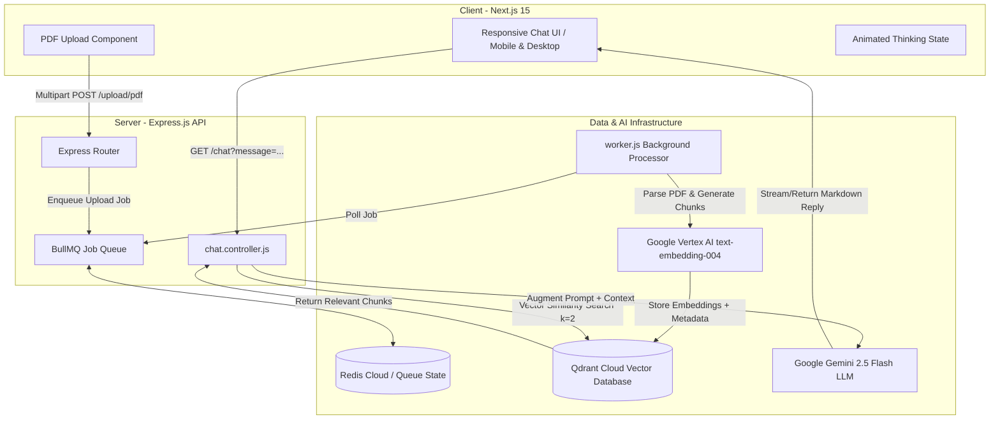

# 📄 PDF-RAG Assistant

> An enterprise-grade, full-stack **Retrieval-Augmented Generation (RAG)** system that allows users to upload PDF documents and ask questions grounded in document context using **Google Gemini 2.5 Flash**, **Qdrant Vector DB**, **Express.js**, **BullMQ + Redis**, and **Next.js 15**.

---

## 🌟 System Architecture & End-to-End Data Flow



---

## ✨ Features at a Glance

- 🧠 **Context-Grounded QA**: Accurately answers user questions using PDF document context via similarity search.
- ⚡ **Asynchronous Background Processing**: Ingests and processes large PDFs asynchronously using BullMQ and Redis without blocking the API looper thread.
- 🚀 **Next-Gen LLM & Embeddings**: Powered by **Google Gemini 2.5 Flash** for rapid, accurate completions and **Vertex AI (`text-embedding-004`)** for vector embeddings.
- 🎯 **Qdrant Vector Database**: Auto-creates collections and performs high-speed cosine vector similarity searches.
- 📱 **Responsive UI & Mobile Drawer**: Split-screen dashboard for desktop and slide-in drawer navigation for mobile devices.
- 💡 **Real-Time Thinking Indicator**: Visual animated status (`"Searching vector database & thinking..."`) during LLM generation.
- 📜 **Markdown & Source References**: Formats responses with rich Markdown and expandable source references displaying the exact filename, page number, and text excerpt.
- 🎭 **Playwright Automated Testing**: Built-in E2E UI and API test automation suite (`tests/api-backend.spec.js` and `tests/ui-frontend.spec.js`).

---

## 🛠️ Technology Stack

| Layer | Technology |
| :--- | :--- |
| **Frontend** | Next.js 15, React 19, Tailwind CSS v4, Clerk Auth, Lucide Icons, ReactMarkdown |
| **Backend API** | Node.js, Express.js (ES Modules) |
| **Queue & Cache** | BullMQ, Redis (`ioredis`) |
| **Vector DB** | Qdrant Cloud (`@langchain/qdrant`, `@qdrant/js-client-rest`) |
| **AI / LLM** | Google Gemini 2.5 Flash, Google Vertex AI Embeddings (`text-embedding-004`) |
| **Automation Testing**| Playwright (`@playwright/test`) |

---

## 📁 Repository Directory Structure

```
PDF-RAG/
├── client/                    # Next.js 15 Frontend Web Application
│   ├── app/                   # App Router pages and components
│   ├── public/                # Static assets
│   ├── README.md              # Client-specific documentation
│   └── package.json
├── server/                    # Express.js API & BullMQ Background Worker
│   ├── config/                # Qdrant, OpenAI, and Vertex AI configs
│   ├── controllers/           # RAG chat logic controller
│   ├── routes/                # Express API routes
│   ├── uploads/               # Temporary uploaded PDF storage
│   ├── app.js                 # Express server entry point
│   ├── worker.js              # BullMQ worker process
│   ├── README.md              # Server-specific documentation
│   └── package.json
├── tests/                     # Playwright Automation Test Suite
│   ├── fixtures/              # Test binary fixtures (sample.pdf)
│   ├── api-backend.spec.js    # Backend API automation test spec
│   └── ui-frontend.spec.js    # Frontend E2E UI automation test spec
├── playwright.config.js       # Playwright configuration
├── PLAYWRIGHT_AUTOMATION_TESTS.md # Playwright Testing & Resume Guide
├── package.json               # Root project dependencies & test runner scripts
└── README.md                  # Main project README
```

---

## 🚀 Local Development Setup

### 1. Prerequisites
- **Node.js**: `v18+` or `v20+`
- **Redis Instance**: Local Redis (`127.0.0.1:6379`) or a free [Redis Cloud](https://app.redislabs.com/) database.
- **Qdrant Vector Cluster**: Local Qdrant (`http://localhost:6333`) or [Qdrant Cloud](https://cloud.qdrant.io/).
- **Google Gemini API Key**: Obtain a key from [Google AI Studio](https://aistudio.google.com/app/apikey).

### 2. Step-by-Step Installation

```bash
# Clone the repository
git clone https://github.com/abhishekpd01/PDF-Chatbot.git
cd PDF-Chatbot

# Install root dependencies (Playwright testing)
npm install

# Install Server dependencies
cd server
npm install

# Install Client dependencies
cd ../client
npm install
```

### 3. Environment Configuration

Create `server/.env`:
```env
QDRANT_URL="https://<your-cluster>.cloud.qdrant.io"
QDRANT_API_KEY="your-qdrant-api-key"
GEMINI_API_KEY="AIzaSy..."
BASE_URL="https://generativelanguage.googleapis.com/v1beta/openai/"
HOST="127.0.0.1"
REDIS_PORT=6379
REDIS_PASSWORD=""
PORT=8000
```

Create `client/.env`:
```env
NEXT_PUBLIC_CLERK_PUBLISHABLE_KEY=pk_test_...
CLERK_SECRET_KEY=sk_test_...
NEXT_PUBLIC_SERVER_URL="http://localhost:8000"
```

### 4. Running the Application

```bash
# Terminal 1: Run Server & BullMQ Worker
cd server
npm start

# Terminal 2: Run Next.js Client
cd client
npm run dev
```

Visit **`http://localhost:3000`** in your browser.

---

## 🎭 Automation Testing (Playwright)

With both the server and client running:

```bash
# Run all Playwright tests (UI + API)
npm test

# Run tests in Playwright Interactive UI Mode
npx playwright test --ui

# Run only API tests
npx playwright test tests/api-backend.spec.js

# View HTML Test Results Report
npm run test:report
```

---

## 🌐 Production Deployment

- **Backend Server**: Deploy the `server/` directory on **[Render](https://render.com/)** as a Web Service (`npm install` build command, `npm start` start command).
- **Frontend Client**: Deploy the `client/` directory on **[Vercel](https://vercel.com/)** (Set `NEXT_PUBLIC_SERVER_URL` to your live Render backend URL).

---

## 💼 Resume Summary Bullet Points

> - **Full-Stack PDF-RAG System**: Engineered an AI-powered PDF Question-Answering application utilizing Next.js 15, Express.js, Qdrant Vector DB, and Google Gemini 2.5 Flash.
> - **Asynchronous Job Ingestion**: Built a decoupled BullMQ + Redis background worker pipeline to parse, chunk, embed, and index large PDF files without blocking the API loop.
> - **Automation Testing Architecture**: Developed a Playwright test suite validating API contracts (`POST /upload/pdf`, `GET /chat`) and E2E UI features (mobile viewports, thinking animations, markdown output).
